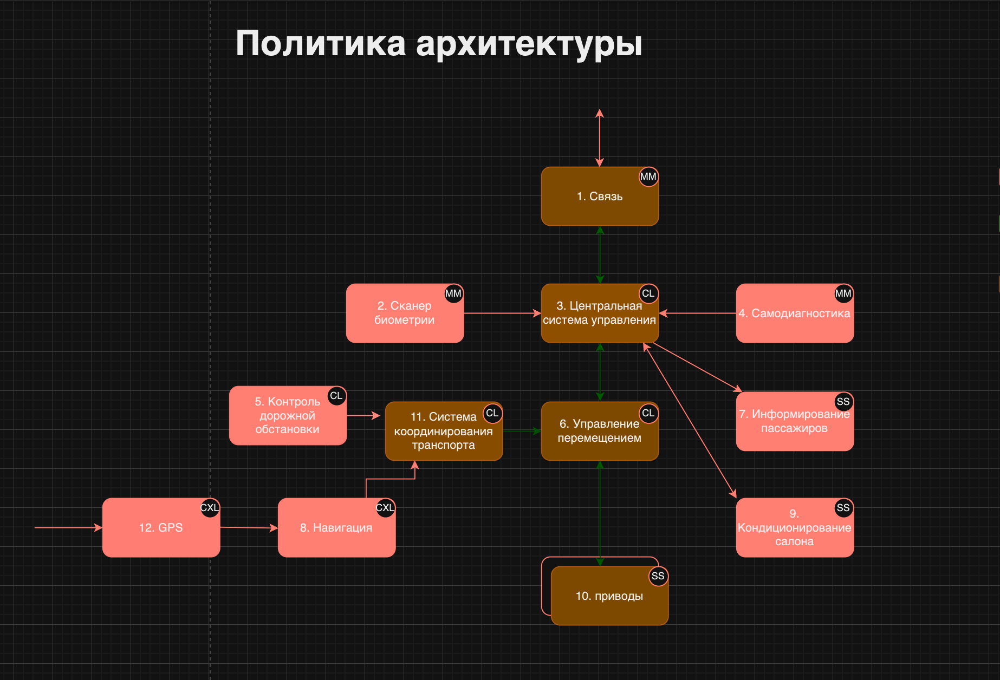

## Краткое описание назначения и применения продукта
Продукт - автономный автобус с бесконтактной оплатой проезда на основе биометрии

Автобус сканирует лицо пассажира на входе и проводит оплату после идентификации.

## Роли пользователей
Оператор системы - вводит информацию о маршрутах

Сотрудник депо - проверяет системы автобуса перед выходом на маршрут

Пассажиры - перемещаются в автобусе согласно маршруту

## Цели безопасности
1. Выполняются только аутентичные задания на перевозки

2. Для перемещения используется только авторизованный маршрут

3. Перемещение осуществляется только в авторизованных границах параметров перемещения, с учётом временных скоростных ограничений

4. Только авторизованные пользователи имеют доступ к конфиденциальным данных пассажиров

## Предположения безопасности
1. система планирования перевозок благонадёжна

2. дорожные знаки аутентичны и установлены авторизованным образом

- система распознавания биометрии и оплаты проезда благонадёжна

- на всём протяжении авторизованных маршрутов исключено появление людей

- на всём протяжении авторизованных маршрутов исключено внезапное появление препятствий, для избежания столкновения с которым необходимо превысить максимально допустимое ускорение при торможении

## Предполагаемая архитектура

