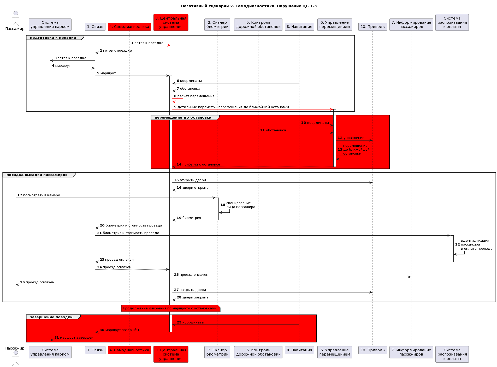
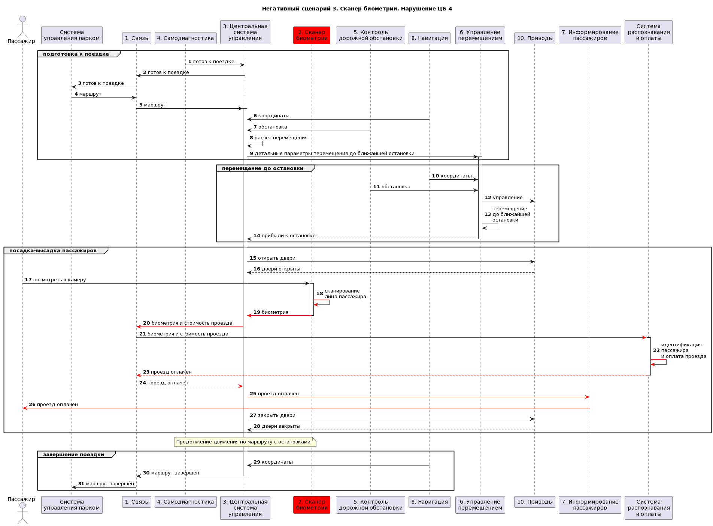

## Краткое описание назначения и применения продукта
Продукт - автономный автобус с бесконтактной оплатой проезда на основе биометрии

Автобус сканирует лицо пассажира на входе и проводит оплату после идентификации.

## Роли пользователей
Оператор системы - вводит информацию о маршрутах

Сотрудник депо - проверяет системы автобуса перед выходом на маршрут

Пассажиры - перемещаются в автобусе согласно маршруту

## Цели безопасности
1. Выполняются только аутентичные задания на перевозки

2. Для перемещения используется только авторизованный маршрут

3. Перемещение осуществляется только в авторизованных границах параметров перемещения, с учётом временных скоростных ограничений

4. Только авторизованные пользователи имеют доступ к конфиденциальным данных пассажиров

## Предположения безопасности
- система планирования перевозок благонадёжна

- дорожные знаки аутентичны и установлены авторизованным образом

- система распознавания биометрии и оплаты проезда благонадёжна

- на всём протяжении авторизованных маршрутов исключено появление людей

- на всём протяжении авторизованных маршрутов исключено внезапное появление препятствий, для избежания столкновения с которым необходимо превысить максимально допустимое ускорение при торможении

## Компоненты

| Название                                      | Назначение                                                     | Комментарий  |
|-----------------------------------------------|----------------------------------------------------------------|-----|
| **1.Связь**                                   | Распределения задач на перевозки и с системой оплаты проезда   |     |
| **2. Сканер биометрии**                       | Сканирует лицо пассажира в 3D                                  |     |
| **3. Центральная система управления**         | Управление процессом перевозки пассажиров автобусом            |     |
| **4. Самодиагностика**                        | Оценки работоспособности системы                               |     |
| **5. Контроль дорожной обстановки**           | Анализ дорожных знаков ...                                     |     |
| **6. Управление перемещением**                | Перемещение автобуса по заданному маршруту                     |     |
| **7. Информирование пассажиров**              | Состояние оплаты для входящих пассажиров, маршрут ...          |     |
| **8. Навигация**                              | Навигационная информация о положении автобуса                  |     |
| **9. Кондиционирование салона**               | Обеспечивает требуемую температуру в салоне                    |     |
| **10. Приводы**                               | Реализуют управление всей мехатроникой автобуса                |     |
| **11. Система координирования транспорта**    | Модуль, получающий данные от (12) и (5). Основная координация  |     |
| **12.GPS**                                    | Модуль, получающий сигнал спутника                             |     |

## Предполагаемая архитектура

## Обоснавания уровня доверия
| Название                                      | Уровеень доверия                            | Обоснование                                         |
|-----------------------------------------------|---------------------------------------------|------------------------------------------|
| **1.Связь**                                   |🌕 доверенный, повышающий целостность данных | Этот компонент отвечает за распределение задач транспорта, критичен для всех ЦБ |
| **2. Сканер биометрии**                       |🔴 недоверенный                              | Не беерм в учет ЦБ-4, для других не критичен               |
| **3. Центральная система управления**         |🌕 доверенный, повышающий целостность данных | Управляет процессами перевозок, критичен для ЦБ-1          |
| **4. Самодиагностика**                        |🌕 доверенный, повышающий целостность данных | Компонент, который влияет на "старт" работы, критичиен для работы всего процесса (в самом лучшем варианте стоит разделить на более детальные компоненты) |
| **5. Контроль дорожной обстановки**           |🔴 недоверенный                              | Может выдать неверные данные обстановки, что нарушит ЦБ-3, но эти данные отправят в компонент (11), который еще берет в учет данные из (8) и выдает достоверные данные |
| **6. Управление перемещением**                |🟢 доверенный                                | Осущетвляет перемещение автобуса, получает только достоверные данные, отвечает за ЦБ-1,2,3 |
| **7. Информирование пассажиров**              |🔴 недоверенный                              | Не критичен для наших ЦБ                                   |
| **8. Навигация**                              |🔴 недоверенный                              | Может получить неверную информацию из (12), отпрааляет ее в (11), где это проблема решается, путем получения информации с разных источников |
| **9. Кондиционирование салона**               |🔴 недоверенный                              | Не критичен для наших ЦБ                                   |
| **10. Приводы**                               |🔴 недоверенный                              | Влияет на осуществление перевозки пассажиров, нурашая ЦБ-1 |
| **11. Система координирования транспорта**    |🌕 доверенный, повышающий целостность данных | Анализ, полученных данных. Получает данные из двух источников, анализируя которые, и тщательнее проверяя - выдает достоверные данные для (6), влияет на ЦБ-1,2,3 |
| **12.GPS**                                    |🔴 недоверенный                              | Возможно получение неверных данных спутника                |

### Важно !
Здесь расмотрена общая архитектура, где необходимо доработать компоненты (10) (6) (1), разбив их на более детальные составляющие.

## Негативные сценарии

| Номер сценария | Описание |
|--|-----|
NS-1 | Связь(пример)
NS-2 | Управление перемещением
NS-3 | Сканер биометрии

**NS-1: Связь**

**NS-3: Управление перемещением**

**NS-3: Сканер биометрии**

